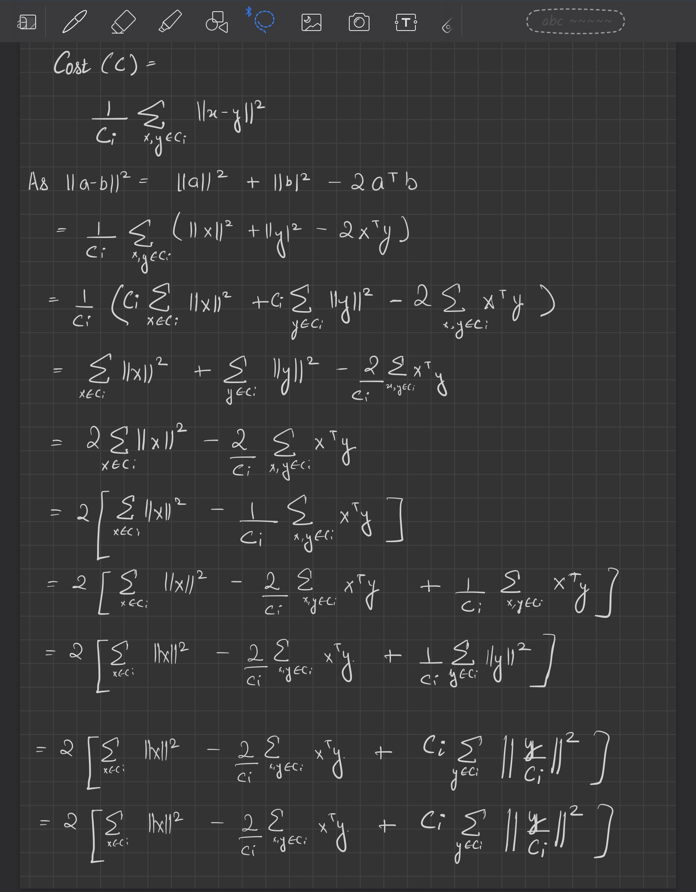
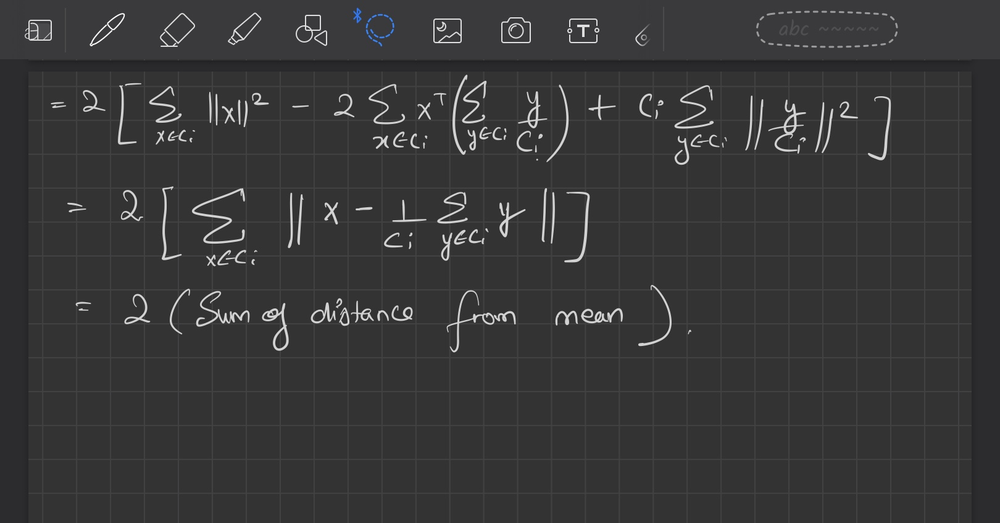
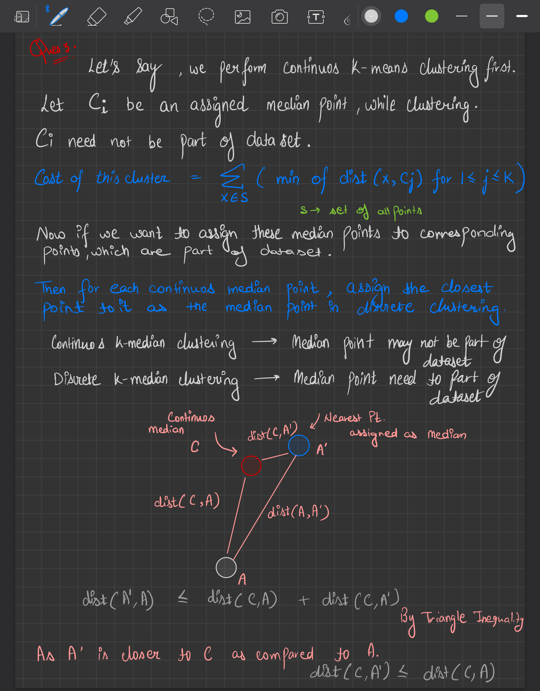
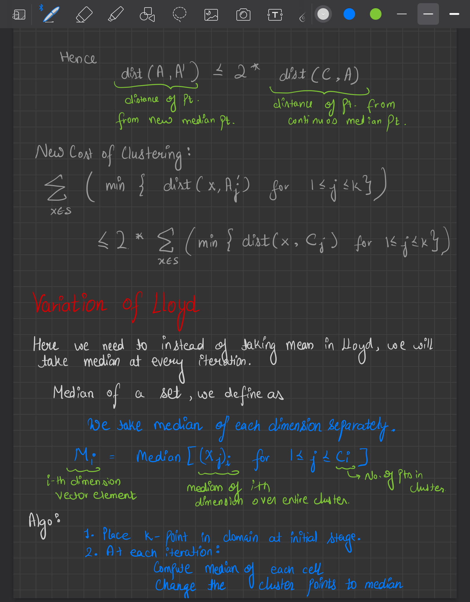

<h2 align = "center"> CS 328 : Homework 1 </h2>

 Sachin Yadav 

  

## Ques 1.
No, it is not a metric distance function. As it does not satisfies **Triangular Inequality**.
Counter Example: Let x = $(1, 2)$ , y = $(5, 6)$ and z = $(2, 6)$

$d(x, y)$ = $min(|1-5|, |2 - 6|)$ = $4$   
$d(x, z)$ = $min(|1-2|, |2 - 6|)$ = $1$   
$d(z, y)$ = $min(|2-5|, |6 - 6|)$ = $0$   

Here $d(x, z) + d(z, y)$ < $d(x, y)$
It violates Triangular Inequality, hence not metric.

## Ques 2.

$$ Cost(C) = \frac{1}{C_{i}}\sum_{x, y \in C_{i}} \lVert x - y \rVert ^{2} $$

- Here we can manipulate the cost function and can reach a conclusion from it.
- We know that 
    $$ \lVert a - b \rVert ^ {2} = \lVert a \rVert ^ {2} + \lVert b \rVert ^ {2} - 2 \times a ^{T}b $$

- From the above result, we get that the objective to reduce the square sum of distances from the cluster mean is the same as reducing the sum of average pairwise distance squares.
- Hence **Lloyd's alogrithm** would also work here.

## Ques 3.

## Ques 4.
Jupyter Notebook: **04.pynb**   
  
### Greedy K-Center Algo over entire Dataset

## Comparison of Greedy vs Optimal over sample size of 20

## Ques 5.   

**Youtube Video**: https://youtu.be/a7FEbnSB6NM
    
### Problems faced.
- Some of the rows (countries) were there which had most of the Nan Values for the coal consumption.
- SO I made a threshold of around 70%. All the rows which had more than or equal to 30 % of NaN values were removed from the data.

### Getting rid of Missing Values:
- Because of the missing values, the animation was giving error sometimes. 
- So as above, I chose a threshold and filtered the data accordingly.
- After that I checked every data table once of NaN values.

### Combining Multiple tables for final table:
- Here for every country, I needed population, income and the coal consumption over the years.
- So I had to combine these multiple tables properly.

